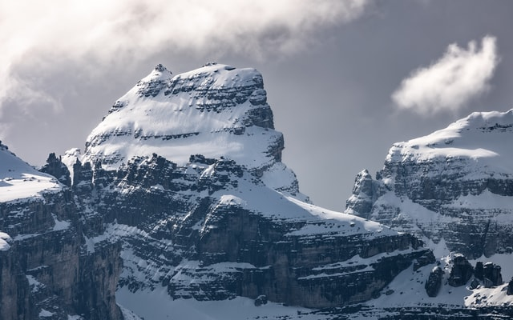

# Blue App
[](https://wakatime.com/badge/user/7f87e987-585c-42b0-863e-1c1da9829ba0/project/ca5b7afb-7f78-4b15-8945-4a095c455079)
[](https://wakatime.com/badge/user/7f87e987-585c-42b0-863e-1c1da9829ba0/project/cc662c49-a02a-4e08-9440-e13833732816)
## Inspired by the Color Blue:


# ...And Mountains.
## ..And Blue Whales.
### ...And other things.
##### ...oh, oceans too.

This was just a project to see how well i could use a specific color pallete. It looks cool and has some nice color combinations. This is the```src code```